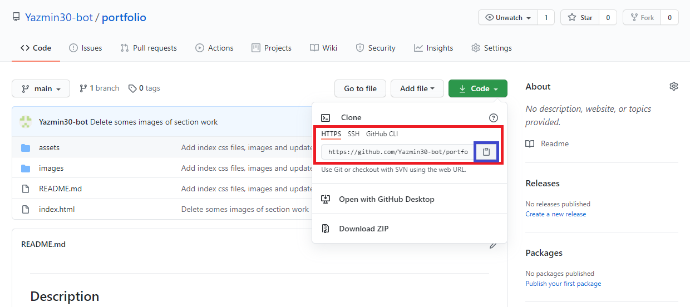
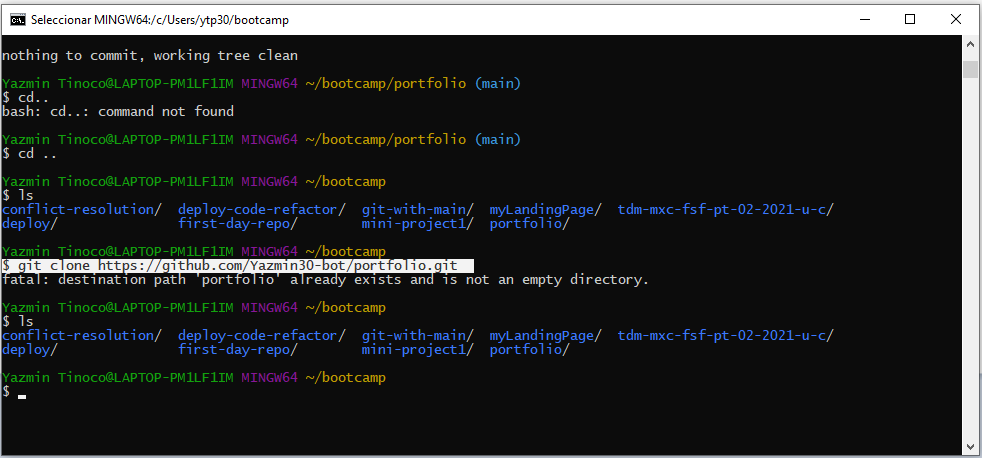

# Professional Portfolio
**Displays my personal portfolio .**
\
&nbsp;
## Description
A portfolio of work can showcase your skills and talents to employers looking to fill a part-time or full-time position. An effective portfolio highlights your strongest work as well as the thought processes behind it. Students who have portfolios with deployed web applications (meaning they are live on the web) are typically very successful in their career search after the boot camp. This last point can’t be stressed enough: having several deployed projects is a minimum requirement to receive an initial interview at many companies.

In order to my professional portfolio follows accessibility standards such as check links are functioning correctly, consolidating the selectors and properties, organizing them to follow the semantic structure of the HTML elements, including comments before each element or section of the page and  applying the core skills: flexbox, media queries, and CSS variables.

## Requirements
This proyect  requires no modules outside of the core.

## Installation
* Go to the following link [https://github.com/Yazmin30-bot/portfolio/](https://github.com/Yazmin30-bot/portfolio/) and clone the link 

* Go to Git-bash and page the github's with the following code `$ git clone https://github.com/Yazmin30-bot/portfolio.git ` 

## Mock-Up

The following animation demonstrates the application functionality:

## Build with 

* [CSS Bootstrap Framework](https://getbootstrap.com/docs/4.3/getting-started/download/) - `CSS Advanced Framework`
* [CSS](https://www.w3schools.com/css/) - `CSS`
* [HTML](https://www.w3schools.com/html/default.asp) - `HTML`
\
&nbsp;
## Links
* The URL of the deployed application.
[https://yazmin30-bot.github.io/portfolio/](https://yazmin30-bot.github.io/portfolio/)

* The URL of the GitHub repository
[https://github.com/Yazmin30-bot/portfolio/](https://github.com/Yazmin30-bot/portfolio/)

## Authors 
* **`Yazmin Tinoco`**   - [Yazmin30-bot](https://github.com/Yazmin30-bot/)
